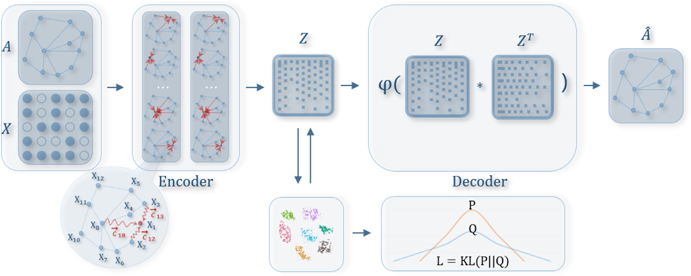

# GAT Experiments

:construction: **UNDER CONSTRUCTION** :construction:

## The Project

Through a hypothetical-deductive methodology, this work aims to better understand the dependence on external clustering methods when Graph Neural Networks (GNNs) are used for community detection tasks. It also proposes alternatives to completely remove the reliance on an external clustering method in the use of GNNs for this type of task.

This project implements the algorithm proposed in [Deep neighbor-aware embedding for node clustering in attributed graphs](https://www.sciencedirect.com/science/article/abs/pii/S0031320321004118), compares the obtained results with those presented in the original article, and suggests some variations to the algorithm.



### Tests and Variations:

To date, the suggested tests and variations may include:

- New mechanisms for centroid detection;
- New loss functions and weight variations;
- Variations in the network structure and parameters;
- New functions for class detection;
- Various parametric tests;

### Centroids via Community Detection

One of the approaches chosen for testing and comparison is community detection using algorithms like Fast Greedy, followed by mapping the centroids based on connectivity degree. This replaces KMeans as the initial centroid detection mechanism. Test results will be shared through this repository.

### Centroids via Seed Selection

Another mechanism to be evaluated in this project is the Seed Expansion method for detecting initial centroids. This approach could eliminate the need for community detection. We believe this method may enhance the algorithm's overall efficiency, but we do not yet have results to confirm the quality of this approach.

### Seed Selection Based on Node Attributes

An approach to be implemented and tested involves seed selection based on node attributes. This could involve assigning distances between nodes based on attribute similarity, for example. A possible method is implementing a weighted K-Core that considers edge weights in subgraph selection. Other algorithms will be implemented and evaluated.

## How to Run

Create a Python virtual environment and install the necessary dependencies:

```
python3 -m venv ./env
source ./env/bin/activate
pip install -r requirements.txt
```

The `run.py` file executes the algorithm and has parameters that can adjust the network training. For more information, run:

### Implemented Centroid Selectors::

Currently, this project includes the implementation of the following algorithms for centroid selection:

- KMeans;
- Fast Greedy;
- K-core;
- PageRank;
- Random;
- Betweenness Centrality;
- Weighted Betweenness Centrality;
- Eigen Vector;
- Closeness Centrality;
- Weighted Closeness Centrality;


## Authors:

Alan Demétrius Baria Valejo

Carlos Pereira Lopes Filho

Guilherme Henrique Messias
